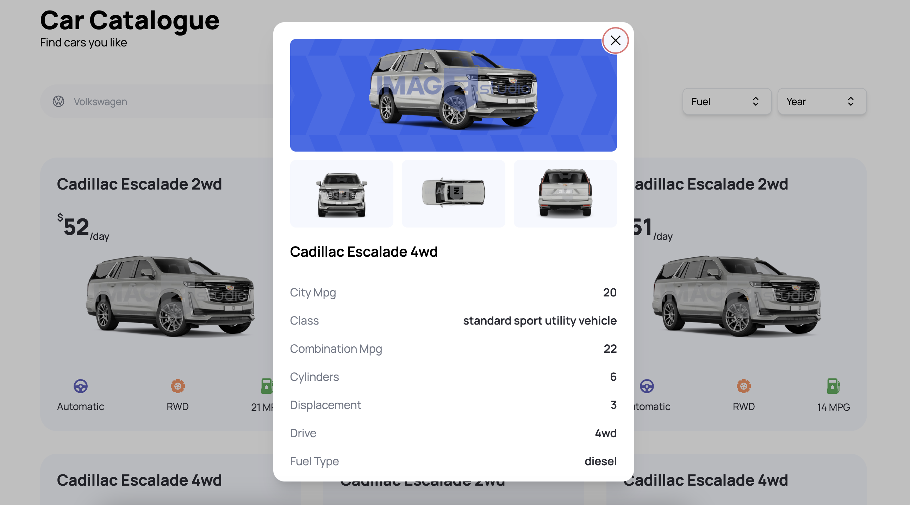

# CarHub - Browse Cars for Rent




CarHub is a modern web application built with Next.js, TypeScript, Tailwind CSS, ReactJS, Rapid API, and Headless UI. It serves as a platform for users to browse a wide selection of cars available for rent.

Link to deployed website: https://carhub-nextjs-drab.vercel.app/

## Features

- **Browse Cars:** View a diverse range of cars available for rent, sorted by various categories and filters.
- **Car Details:** Access detailed information about each car, including specifications, features, and rental rates.
- **Responsive Design:** Enjoy a seamless experience on both desktop and mobile devices.

## Technologies Used

- Next.js: A powerful React framework for building server-side rendered (SSR) and static websites.
- TypeScript: Adds static typing to JavaScript for improved code quality and development experience.
- Tailwind CSS: A utility-first CSS framework for rapidly designing responsive and beautiful interfaces.
- ReactJS: A popular JavaScript library for building user interfaces.
- Headless UI: A set of completely unstyled, accessible UI components for building custom designs.

## Getting Started

Follow these instructions to set up the project locally on your machine:

1. **Clone the repository:**

   ```
   git clone https://github.com/your-username/CarHub.git
   cd CarHub
   ```

2. **Install dependencies:**

   ```
   npm install
   ```

3. **Run the development server:**

   ```
   npm run dev
   ```

4. **Open your browser:**

   Visit `http://localhost:3000` to see CarHub in action!

## Folder Structure

```
.
├── components/          # Reusable React components
├── pages/               # Next.js pages
├── public/              # Static assets (images, etc.)
├── styles/              # Global CSS styles and Tailwind CSS configuration
├── types/               # TypeScript type definitions
├── utils/               # Utility functions
├── .gitignore           # List of files and directories to be ignored by Git
├── next.config.js       # Next.js configuration file
├── package.json         # Node.js package file
├── tsconfig.json        # TypeScript configuration file
└── README.md            # Project documentation (you are here)
```

## Contribution Guidelines

We welcome contributions to improve CarHub! If you have any ideas for new features, bug fixes, or performance enhancements, feel free to open an issue or submit a pull request. Please make sure to follow our [contribution guidelines](CONTRIBUTING.md).

## License

CarHub is licensed under the [MIT License](LICENSE).

## Acknowledgments

- I would like to express my gratitude to the developers of Next.js, TypeScript, Tailwind CSS, ReactJS, and Headless UI for creating such excellent tools.

---
